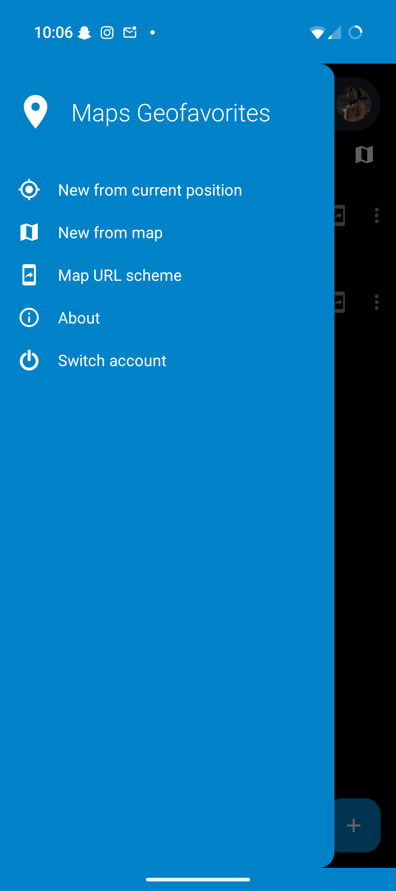
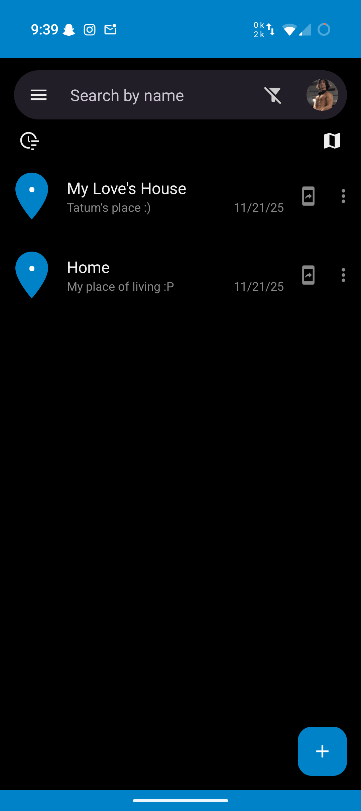
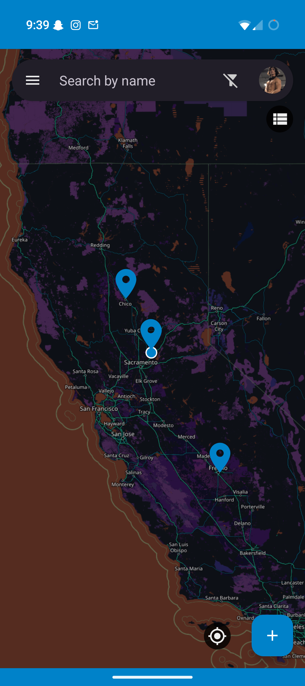

# Nextcloud Maps Geofavorites

An Android app for viewing and managing your Nextcloud Maps geofavorites (location bookmarks) on your mobile device.

[](https://github.com/nickgirga/nextcloud-maps-geofavorites-android/releases/latest)
[](https://github.com/nickgirga/nextcloud-maps-geofavorites-android/actions)

## About This Project

This is a maintained fork of the [original Nextcloud Maps Geofavorites app](https://github.com/penguin86/nextcloud-maps-client) by penguin86. The original project has not received updates in several years, so this fork provides continued maintenance, bug fixes, and new features.

**Key differences from the original:**
- **Active maintenance** - Regular bug fixes and updates to keep the app working with modern Android versions
- **Additional map app support** - Now supports opening locations in OpenStreetMap and Apple Maps apps, not just Google Maps
- **Google's Material 3 Design** - Now utilizes [Material 3 components](https://m3.material.io/) for a more modern feel on Android and to eventually use for [dynamic system colors](https://m3.material.io/styles/color/dynamic/choosing-a-source) and [Nextcloud instance colors](https://docs.nextcloud.com/server/stable/admin_manual/configuration_server/theming.html) ([both not yet implemented](https://github.com/nickgirga/nextcloud-maps-geofavorites-android/issues/5))
- **Automated builds** - GitHub Actions automatically builds and signs releases on every commit to the main branch, making it easy to install and update via [Obtainium](https://github.com/ImranR98/Obtainium)
- **Updated package name** - Uses `com.nickgirga.nextcloudmapsgeofavorites` instead of the original package name

## What Does This App Do?

This app connects to your Nextcloud server and allows you to:

1. **View your geofavorites** - See all location bookmarks you've saved in Nextcloud Maps, displayed either as a scrollable list or on an interactive map
2. **Create new geofavorites** - Save new location bookmarks in three ways:
   - From your current GPS location
   - By manually selecting a point on the map
   - By sharing a geographic link (geo: URI) from another app to Nextcloud Maps Geofavorites
3. **Open locations in map apps** - Tap any geofavorite to open it in your preferred navigation or mapping app (Google Maps, Organic Maps, OpenStreetMap, Apple Maps, etc.)
4. **Manage your bookmarks** - Edit, delete, and organize your saved locations

**Requirements:**
- A Nextcloud server with the [Maps app](https://apps.nextcloud.com/apps/maps) installed
- An Android device running Android 5.0 (API level 21) or higher

## Installation

### Option 1: Install via Obtainium (Recommended)

[Obtainium](https://github.com/ImranR98/Obtainium) is an app that allows you to install and update apps directly from their source repositories.

1. Install Obtainium from [F-Droid](https://f-droid.org/packages/dev.imranr.obtainium.fdroid/) or [GitHub](https://github.com/ImranR98/Obtainium/releases)
2. In Obtainium, add this app using the repository URL: `https://github.com/nickgirga/nextcloud-maps-geofavorites-android` (if using GitHub actions, enable prereleases)
3. Obtainium will automatically notify you of and install new releases

Every commit to the main branch of this repository triggers an automatic build, so you'll receive updates frequently if using prereleases.

### Option 2: Manual Installation

1. Go to the [Releases page](https://github.com/nickgirga/nextcloud-maps-geofavorites-android/releases/latest)
2. Download the latest APK file
3. Install the APK on your Android device (you may need to enable "Install from Unknown Sources" in your device settings)
4. Check the Releases page periodically for new versions

## Building from Source

If you want to build the app yourself:

1. Clone this repository:
   ```bash
   git clone https://github.com/nickgirga/nextcloud-maps-geofavorites-android.git
   cd nextcloud-maps-geofavorites-android
   ```

2. Build using Android Studio (recommended) or Gradle command line:
   ```bash
   ./gradlew assembleRelease
   ```

3. The built APK will be in `app/build/outputs/apk/release/`

## Screenshots





## Technical Credits

This app's codebase is based on:
- The [original Nextcloud Maps Geofavorites app](https://github.com/penguin86/nextcloud-maps-client) by tfederico - Provided the initial app implementation
- [matiasdelellis's Nextcloud SSO example](https://github.com/matiasdelellis/app-tutorial-android) - Demonstrated how to implement [Nextcloud Single Sign-On](https://github.com/nextcloud/Android-SingleSignOn) authentication
- The [forked Nextcloud Maps Geofavorite app](https://github.com/penguin86/nextcloud-maps-client) by penguin86 - Implemented Single Sign-On; maintained until [bd8a0d7](https://github.com/penguin86/nextcloud-maps-client/commit/bd8a0d706dc7bbb34c8b958dc1a24d0e8897bd33) on Feb 29, 2024

## License

This project is licensed under the same license as the original project. See the [LICENSE](LICENSE) file for details.

## Contributing

Contributions are welcome! 

- **Bug reports**: [Open an issue](https://github.com/nickgirga/nextcloud-maps-geofavorites-android/issues/new) describing the problem and steps to reproduce it
- **Feature requests**: [Open an issue](https://github.com/nickgirga/nextcloud-maps-geofavorites-android/issues/new) explaining what you'd like to see added and why
- **Code contributions**: Fork the repository, make your changes, and submit a pull request

## Contact

For questions or issues, please use the [GitHub Issues](https://github.com/nickgirga/nextcloud-maps-geofavorites-android/issues) page.
